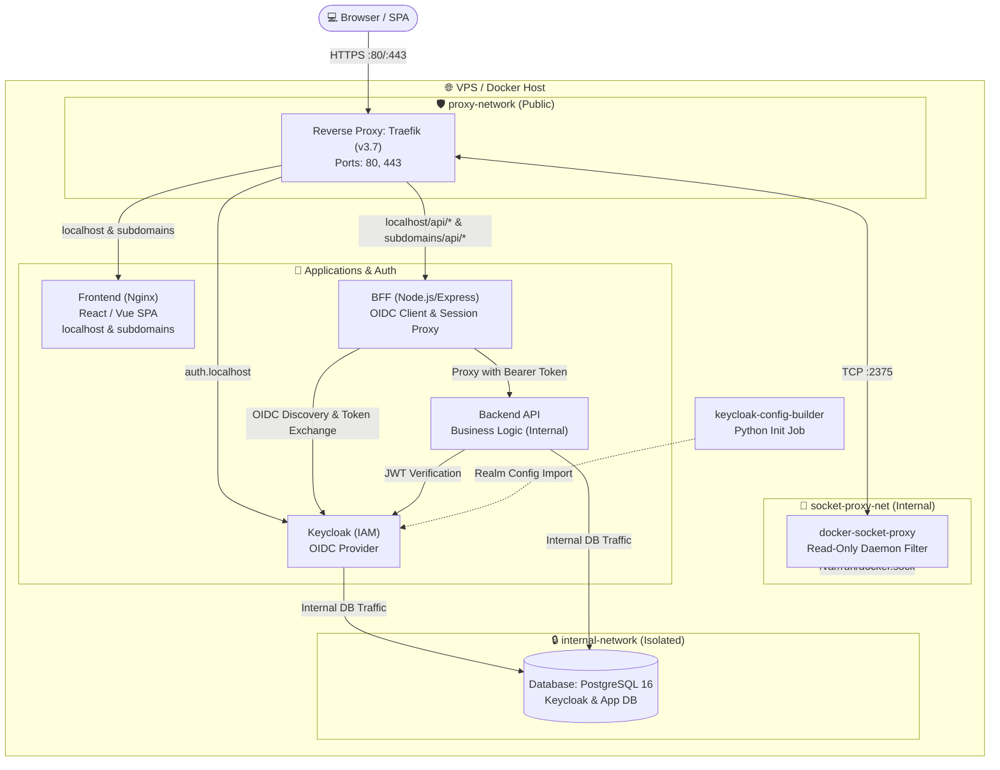

# SecureAuth-Stack — Production-Ready OIDC/OAuth2 System

> [!CAUTION]
> **🚧 Under Construction:** This architecture stack is actively being refined. Core infrastructure, Traefik routing, Keycloak OIDC integration, and Docker network isolation are fully functional, while demo UI components are being finalized.


A modern, highly secure containerized architecture leveraging the **Backend-For-Frontend (BFF)** pattern with **OIDC / OAuth2 (PKCE)** integration via **Keycloak**.

---

## 🔑 Key Architectural Highlights

* **Backend-For-Frontend (BFF) Pattern:** The browser-side Single Page Application (SPA) never touches or stores raw JWTs (`access_token`, `refresh_token`). Zero token storage in `localStorage` or `sessionStorage`.
* **Encrypted Server-Side Sessions:** Client-to-BFF communication relies exclusively on encrypted session cookies hardened with `HttpOnly`, `Secure`, and `SameSite=Lax` flags (mitigating XSS and CSRF risks).
* **OIDC + PKCE (Proof Key for Code Exchange):** Full `Authorization Code Flow` with PKCE. Token exchanges occur strictly over secure backchannel networks.
* **Complete Network Segmentation:** Neither the Backend API nor the PostgreSQL database are exposed to the public internet. They operate inside isolated Docker virtual networks.
* **GDPR Compliance & Transport Security:** Edge TLS termination handled by Traefik v3.7.
* **Docker Socket Hardening:** Traefik interacts with the Docker daemon safely via `tecnativa/docker-socket-proxy` in read-only mode.

---

## 🏗️ Container Architecture (local development)




---

## 🌐 Network Segmentation

| Network | Exposure | Description |
| --- | --- | --- |
| **`proxy-network`** | Public (via Traefik) | Connects publicly accessible entrypoints (Frontend, BFF, Keycloak). Edge TLS is terminated here. |
| **`internal-network`** | Isolated (Internal) | Completely closed network with no external routing. Hosts internal microservices and databases. |
| **`socket-proxy-net`** | Isolated (Internal) | Dedicated channel allowing Traefik to query `docker-socket-proxy` for dynamic service discovery. |

---

## 🛠️ Tech Stack

* **Reverse Proxy:** Traefik v3.7
* **Identity & Access Management:** Keycloak 26.7
* **Backend-For-Frontend (BFF):** Node.js / Express (OpenID Client, Session Storage, API Proxy)
* **Backend API:** Internal API (Stateless JWT Bearer validation)
* **Frontend:** Multi-domain SPA (React / Vue) served via Nginx
* **Database:** PostgreSQL 16
* **Security Layer:** Docker Socket Proxy (`tecnativa`)

---

## 🚀 Local Development Setup

### Prerequisites

* Docker Engine `>= 24.0`
* Docker Compose `>= 2.20`
* A local `.env` file created from `.env-template`


### 1. Initialize Keycloak Realm & Clients

Execute the automated Python configuration tool to import realms, clients, and roles from config files and variables from .env file:

```bash
docker compose --profile init run --rm --no-deps keycloak-config-builder

```

### 2. For local development only!

Modify the script contents according to domains you use.

```bash
./generate_certs.sh
```


### 3. Build and Run Containers

```bash
docker compose up -d --build

```


### 4. Local Domain Mapping

Ensure your `/etc/hosts` file contains the following entries:

```text
127.0.0.1 localhost forms.localhost blog.localhost cook.localhost auth.localhost traefik.localhost

```

* **Main Application:** `https://localhost`
* **Subdomains:** `https://forms.localhost`, `https://blog.localhost`, `https://cook.localhost`
* **Keycloak Admin Console:** `https://auth.localhost`
* **Traefik Dashboard:** `https://traefik.localhost`

---

## 📋 Production Readiness Checklist

Before deploying to production, ensure you complete the following tasks:

* [ ] Remove `NODE_TLS_REJECT_UNAUTHORIZED=0` environment variable from the BFF service
* [ ] Transition Keycloak startup command from `start-dev` to `start`
* [ ] Replace local self-signed certificates with Let's Encrypt (ACME challenge) inside Traefik (traefik_dynamic.yml + docker-compose.yml config)
* [ ] Replace environment secrets with Docker Secrets or a Vault solution
* [ ] Configure `COOKIE_DOMAIN=.yourdomain.com` in BFF to enable seamless SSO across all subdomains
* [ ] Use host filesystem volume encryption (LUKS) for database persistence
* [ ] Modify all keycloak json files, which use localhost using your domain name
* [ ] Modify subdomains according to your needs
